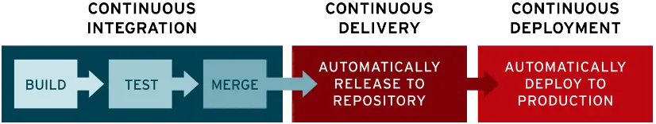

<!--
TODO: Setup OBS and VSCode
-->

<style>
:root {
	--color-highlight-heading: #ff921e;
}

.columns {
	display: grid;
	grid-template-columns: repeat(2, minmax(0, 1fr));
	gap: 1rem;
  	background:linear-gradient(#000,#000) center/2px 100% no-repeat;
}
</style>

# **CI/CD com <br> Github actions**

Orador: João Capucho


<!--
PREFLIGHT CHECKLIST:
- Meter os repositórios a público
- Verificar todos os links a funcionar e abrir por ordem
- Correr versão local do site react
- Abrir um code por cada pasta
- Começar OBS e verificar as sources e as scenes
- https://support.mozilla.org/en-US/questions/1170143 Maybe?
- Começar uma shell para o python com o venv carregado
  ```
  source .venv/bin/activate
  ```
-->

---

# O que é o **Glua**?


<!--
- Promoção e divulgação de GNU/Linux e de software livre
- Serviços de mirrors e apoio técnico
- Eventos como a install party e o torneio de super tux
- Workshops como este e o de git
-->

---

# O que é **CI/CD**?



<div class="columns">
<div>

##### **Continuous Integration**

Automatização da integração de mudanças num projeto

</div>
<div>

##### **Continuous Deployment**

Automatização da entrega do projeto

</div>
</div>

<!--
- CI/CD são práticas de automatizar processos da developer pipeline
- CD permitir que o software seja distribuído mais frequentemente
- Deployment como especialização para live services
- CI quer permitir que novas mudanças possam ser integradas no produto
  sempre que possível (Falar no merge day)
-->

---

# Métodos tradicionais


---

# Integração contínua


---

# Qual é o **benefício**?

- Testagem frequente do código
- Entrega regular de funcionalidades e bugfixes
- Aumento da produtividade

---

<!-- _backgroundImage: none -->


# **Github actions**

- Oferta do Github para automatização e CI/CD
- Configuração fácil através de ficheiros YAML

<!--
- Permite mais que CI/CD mas nós só vamos falar de CI/CD
- A configuração vive no repo (precisam de usar git)
-->

---

# **Workflows**

- Ficheiros de configuração para as github actions
- Definidos no diretório `.github/workflows`
- Escritos em YAML (extensão `.yml`)

<!--
- Nome do ficheiro não importa desde que esteja dentro da pasta
- Falar brevemente de YAML
-->

---

# Exemplo

```yml
name: Github action 101
run-name: Github action do workshop do glua
on: [push, workflow_dispatch]
jobs:
  cat-hello:
    runs-on: ubuntu-latest
    steps:
      - uses: actions/checkout@v3
      - run: cat hello
```

<!--
- `name` define o nome do workflow (senão o nome do ficheiro é usado)
- `run-name` nome de uma dada execução do workflow pode utilizar variaveis
- `on` events (falar a seguir)
- `jobs` jobs (falar a seguir)
-->

---

# **Events**

Um event dita quando é que um workflow é executado

- Definidos no campo `on: `
- Um workflow pode ter um ou mais events
- Existem events para quase tudo: novos commits, release criado, ativação manual, ...
- Alguns events têm argumentos para filtrar o event

<!--
- O campo aceita um event ou uma lista de events
- Falar da utilidade dos filtros
-->

---

<style scoped>
pre {
	margin: 0;
}
</style>

# Exemplos

- Ativação manual

	```yml
	on: workflow_dispatch
	```

- Novos commits em qualquer branch

	```yml
	on: push 
	```

- Novos commits no branch `main`

	```yml
  on:
      push:
        branches:
          - 'main'
	```
---

# **Jobs**

Um job é um conjunto de **steps** que são executados sequencialmente.

- Definidos no campo `jobs: `
- Um workflow pode ter um ou mais jobs
- Os jobs podem ser executados em paralelo ou ter dependências entre si

---

# **Steps**

Um step pode ser código da linha de comandos ou uma **action**.

- Definidos no campo `steps: ` de um job
- Passos na linha de comando usam a diretiva `run: ` 
- Actions usam a diretiva `uses: ` 
- Um nome pode ser dado no campo `name: `

---

# **Actions**

Uma action é uma aplicação desenhada para fazer tarefas mais complexas no github actions.

- Estas podem carregar o nosso repositório ou instalar uma versão do python
- Podemos escrever as nossas próprias actions...
- ...ou ~~copiar~~ usar uma já feita
- Existem mais de 10000 actions no marketplace do github ([Marketplace actions](https://github.com/marketplace?type=actions))

---

# Exemplo

```yml
jobs:
  cat-hello:
    runs-on: ubuntu-latest
    steps:
      - name: Checkout repo
        uses: actions/checkout@v3
      - name: Mostrar o banner
        run: cat hello
  install-python:
    runs-on: ubuntu-latest
    steps:
      - name: Set up Python 3.9
        uses: actions/setup-python@v4
        with: # Inputs permitem configurar a action
          python-version: 3.9
```

<!--
- Falar do `runs-on`, escolhe o OS da vm, os outros são mais caros!
- `cat-hello` é o job name
- Falar da syntax YAML dos `steps` (lista de objetos)
-->

---

# Casos práticos

- Workflow de testagem automática com python
- Workflow de build e deployment de um site React para as github pages
- Perfis do github dinâmicos

<!--
- Transicionar para o code nos repos

- Python
-- Mostrar aplicação e testes muito brevemente
-- Mostrar requirements.txt
-- Falar que ter dependencias loose em CI, é uma maneira de ter erros dificeis de dar debug
-- Mostrar como instalar a partir dele
   ```
   pip install -r requirements.txt
   ```
-- Mostrar como gerar
   ```
   pip freeze > requirements.txt
   ```
-- (https://github.com/JCapucho/github-actions-workshop-python)
-- Mostrar o indicador no commit e na história
-- Mostrar a actions tab
-- Mostrar o workflow específico (Barra esquerda)
-- Mostrar a run que correu bem
-- Mostrar a run que correu mal
-- Falar da log retention

- React:
-- Mostrar site localmente
-- Mostrar remoto a não funcionar
-- (https://jcapucho.github.io/github-actions-workshop-react/)

-- (Mostrar build-only.yml)
-- (https://github.com/JCapucho/github-actions-workshop-react/actions/runs/4178423332/jobs/7237198608)

-- (Mostrar deploy-commented.yml)
-- (https://github.com/JCapucho/github-actions-workshop-react/actions/runs/4178820831/jobs/7238069164)

-- Falar da existência do GITHUB_TOKEN
--- Token unico criado para cada workflow
--- Permite aceder as funcionalidades do github
--- Têm permissões controladas e reduzidas
-- Falar das permissões (menos é melhor)

-- Passos para ativar pages com actions:
--- Settings>Pages
--- Source: Github actions

-- Correr workflow e mostrar site
-- (https://github.com/JCapucho/github-actions-workshop-react/actions/workflows/deploy.yml)

-- Falar do base url (vite.config.ts)

- Perfil dinâmico
-- (https://github.com/JCapucho/JCapucho)
-- Mostrar perfil inicial
-- Fazer push das mudanças
-- Falar do schedule event 
-- cron syntax
```
minute (0-59),
| hour (0-23),
| |    day of the month (1-31),
| |    | month of the year (1-12),
| |    | | day of the week (0-6 with 0=Sunday).
0 */12 * * *
```
-- Podemos ter mais que um schedule
-- Mostrar perfil com a action
-- Falar da possibilidade de alterar o repositório como caso prático
-- Falar da existência de dynamic READMEs com github actions (uteis para documentação)
-- Schedule é desativado depois de 60 dias de inatividade no repo
-->

---

# Custos

- As github actions são grátis para repositórios públicos
- Os repositórios privados são cobrados ao minuto
	- Contas no plano grátis têm 2000 minutos/mês
	- Contas no plano Pro têm 3000 minutos/mês
	- Minutos extra têm um custo acrescido
- Para os estudantes UA o github education dá acesso ao plano Pro de graça

<!--
- Falar do custos do tipo de vm
- Falar de restrições ao uso
-- 6 horas (ninguem vai atingir)
-- Nada de minerar bitcoin :)
-- Logs têm retenção limitada
-->

---

# **Pausa para questões**

---

# Tópicos **avançados**

- Integração com pull requests
- Caching entres execuções de workflows
- Matrix strategy, Outputs e Dependências
- Correr workflows localmente

<!--
- "Integração com pull requests":
-- Retornar ao código para react
-- Abrir pr.yml
-- Mostrar o evento `pull_request` (é simples!)
-- Mostrar test PR
-- (https://github.com/JCapucho/github-actions-workshop-react/pull/1)
-- Falar dos automatic checks (incluidos por defeito)
-- Falar do auto merge (Settings > General > Allow auto-merge)
-- TODO: Adicionar imagem do auto-merge ao OBS

- "Caching entres execuções de workflows":
-- Falar brevemente do projeto
--- API escrito em Rust, linguagem compilada
--- Demora um bocado a compilar
--- Mostrar run sem caching
--- (https://github.com/JCapucho/github-actions-workshop-rust/actions/runs/4218419085/jobs/7322917802)
-- Falar de caching
--- Permite guardar dependências e a sua compilação para acelerar runs seguintes
--- 3 maneiras de configurar:
--- Pode ser usada através da cache action (interface avançada mas permite configurar tudo)
--- (https://github.com/actions/cache)
--- Nas actions do github para python, node, etc existe um input `cache` que permite
    configurar de maneira mais simples para a linguagem a cache
--- Actions da comunidade que implementam cache para setups comuns (usamos esta)
-- Mostrar run com caching e cache
-- (https://github.com/JCapucho/github-actions-workshop-rust/actions/runs/4234238314/jobs/7356253523)
-- Falar brevemente de limites (7 dias 10 GB)

- "Matrix strategy, Outputs e Dependências":
-- Mostrar o build.yml
-- Explicar as partes novas
--- Falar do jobs condicionais
--- (https://github.com/JCapucho/github-actions-workshop-rust/actions/runs/4235006828) 
--- Falar do jobs condicionais, outputs e dependências
--- (https://github.com/JCapucho/github-actions-workshop-rust/actions/runs/4235251786)
--- Falar da matriz
--- Falar de steps condicionais
--- (https://github.com/JCapucho/github-actions-workshop-rust/actions/runs/4235006828/jobs/7358079136)

- "Correr workflows localmente"
-- (https://github.com/nektos/act)
-- Permite testar localmente os workflows
-- Mais rápido e não gasta minutos
-->

---

<style scoped>
pre {
	margin: 0;
}
</style>

## Correr **workflows** localmente

- Correr todos os workflows (`push` event)

	```sh
	$ act
	```

- Correr todos os workflows com um event específico

	```sh
	$ act workflow_dispatch
	```

- Correr um workflow específico

	```sh
  $ act -W .github/workflows/pipeline.yml
	```

---

# Fim da apresentação
